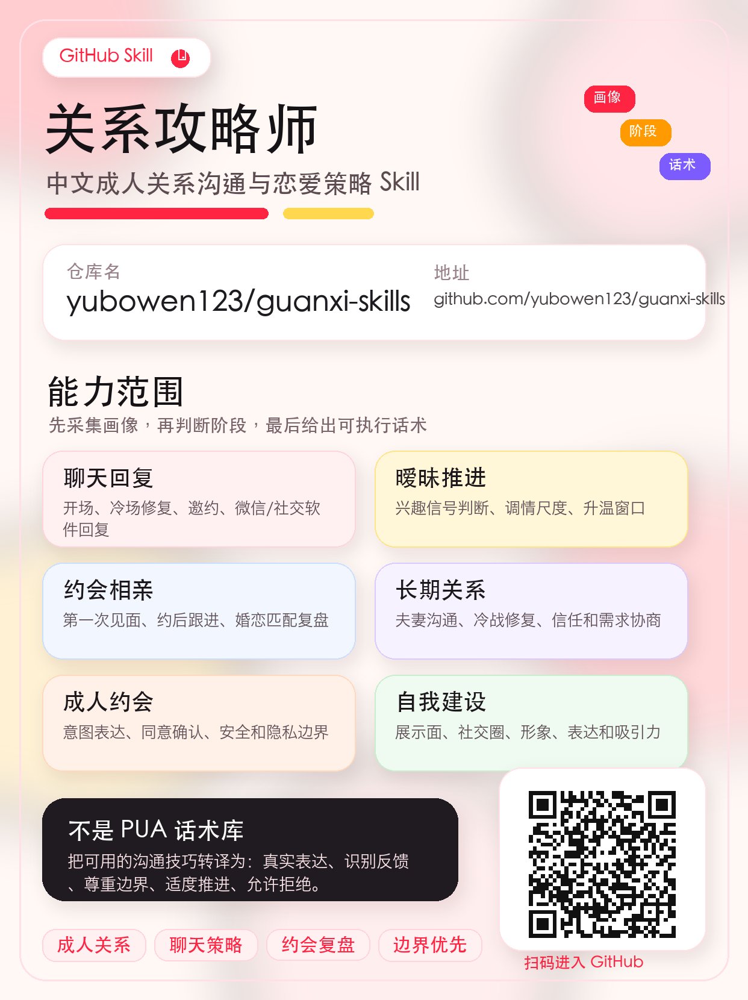
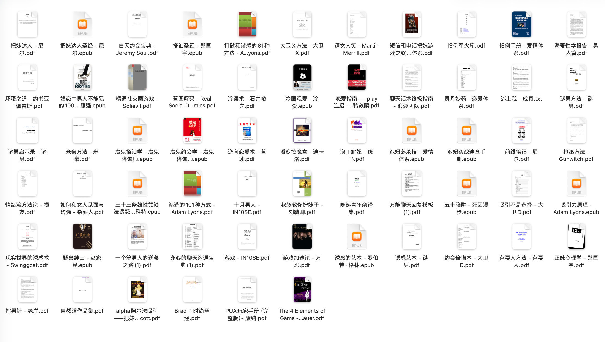

# 关系攻略师

中文成人关系沟通与恋爱策略 Skill。适用于聊天回复、恋爱追求、暧昧推进、约会设计、相亲复盘、夫妻关系、长期关系、分手挽回、成人约会和短期关系沟通。

它不预设“男追女”，而是先采集沟通者与攻略目标的画像，再根据性别、性取向、城市、职业、资产/资源、恋爱经验、关系阶段、对方反馈和用户目标，给出可执行的判断、话术和下一步行动。

## 适用场景

- 分析“对方这句话是什么意思”“我该怎么回”。
- 根据聊天记录判断兴趣信号、无兴趣信号和关系阶段。
- 为微信、社交软件、朋友介绍、线下认识、相亲等场景生成开场和回复。
- 设计第一次约会、相亲见面、约后跟进和暧昧推进节奏。
- 复盘长期关系、夫妻冲突、冷战、信任下降和亲密关系问题。
- 处理成年人之间自愿、清醒、知情的成人约会、性沟通和短期关系边界。
- 将 PUA/操控型话术转译为尊重边界、真实表达、适度推进的关系建议。

## 不做什么

本 Skill 不提供以下内容的执行方案：

- 面向未成年人或无法同意者的亲密/性推进。
- 胁迫、灌酒、下药、利用醉酒或情绪脆弱状态。
- 跟踪、骚扰、无视拒绝、纠缠、侵犯隐私。
- 欺骗身份、虚假承诺、诱导越界、控制伴侣。
- 煤气灯操控、打压羞辱、制造依赖、故意制造嫉妒。

遇到这些请求时，Skill 会改为提供安全、尊重边界的替代建议。

## 工作方式

Skill 会优先确认三件事：

1. 沟通者是谁：年龄、性别/取向、城市、职业、恋爱经验、当前目标、投入资源和底线边界。
2. 攻略目标是谁：年龄、性别/取向、关系状态、认识渠道、当前阶段、最近互动、对方反馈和已知边界。
3. 用户要解决什么：单身问题、具体对象、聊天回复、暧昧推进、约会设计、相亲复盘、长期关系、挽回/放下或成人约会。

输出通常包含：

```text
判断：当前最像处在什么阶段/问题点。
策略：下一步做什么，为什么。
话术：给 1-3 条可直接发的版本，标注语气差异。
风险：哪里可能越界、掉价、过度解读或错过窗口。
追问：只问一个最关键的补充问题。
```

## 文件结构

```text
guanxi-gonglueshi/
├── SKILL.md
├── README.md
├── agents/
│   └── openai.yaml
├── assets/
│   └── reference-scope.png
└── references/
    ├── adult-dating-consent.md
    ├── anti-manipulation-filter.md
    ├── attraction-and-self-work.md
    ├── chat-reply-playbook.md
    ├── dating-and-matchmaking.md
    ├── intake-profile.md
    ├── long-term-relationship.md
    └── stages-and-signals.md
```

## 安装

复制或克隆本目录到 Codex skills 目录：

```bash
mkdir -p ~/.codex/skills
cp -R guanxi-gonglueshi ~/.codex/skills/
```

在 Codex 中可通过以下方式显式触发：

```text
$guanxi-gonglueshi
```

示例：

```text
$guanxi-gonglueshi 帮我分析一下这段聊天，她是不是对我有意思，我下一句该怎么回？
```

## 宣传海报



## 参考资料范围

本 Skill 的知识框架参考了一组本地整理的关系沟通、恋爱、相亲、约会、长期关系、成人约会和两性心理资料，原始资料形态主要为 PDF、EPUB 和 TXT。下图展示的是本次梳理时纳入视野的资料范围：



这些资料覆盖的主题包括：

- 聊天沟通：开场、回复、冷场修复、邀约、电话/短信/微信沟通、幽默表达。
- 关系推进：初识、熟悉、暧昧、约会、亲密确认、长期关系维护。
- 相亲婚恋：相亲见面、条件匹配、婚恋观、家庭因素、关系节奏。
- 自我建设：形象、穿搭、展示面、社交圈、吸引力、生活方式表达。
- 成人亲密关系：性心理、成人约会、短期关系、同意、安全和隐私边界。
- 风险样本：PUA、操控、打压、服从测试、诱导升级等内容只作为反面识别和转译材料。

整理方式不是把原始资料照搬为话术库，而是抽取其中可复用的沟通结构、阶段判断和场景经验，再用“成年人、自愿、清醒、尊重边界、允许拒绝”的原则重新组织。

## 设计来源

该 Skill 参考并吸收了多类公开恋爱/关系 Skill 的结构优点，例如阶段判断、对象档案、聊天回复和场景化参考库；同时结合本地关系沟通、相亲、约会、长期关系与成人约会资料进行原创整理。

核心取向不是复制 PUA 套路，而是把可用的沟通技巧转化为更稳的成人关系能力：真实表达、识别反馈、尊重边界、适度推进和允许拒绝。
